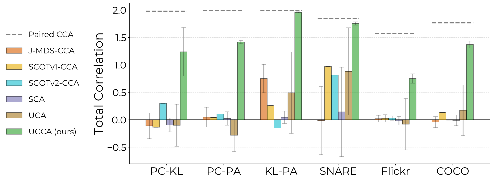

<div align="center">
  
#  UCCA: Unpaired Canonical Correlation Analysis

**NeurIPS 2026**

[](https://shaham-lab.github.io/UCCA_page/)
[](https://arxiv.org/abs/2610.09530)
<!-- [](https://opensource.org/licenses/MIT) -->

</div>

This is the official implementation of UCCA from the NeurIPS 2026 paper: "Unpaired Canonical Correlation Analysis".

🌐 **Project page:** https://shaham-lab.github.io/UCCA_page/

<p align="center">
  
</p>

Canonical Correlation Analysis (CCA) is a fundamental method for multiview shared space learning. However, its strict reliance on paired data poses a significant limitation. **UCCA** is a novel method that learns linear projections to maximize the correlation of the true underlying pairing **without access to any paired samples**. 

---

## How to Use UCCA

The core implementation resides in `ucca/`. The `UCCA` class is designed with an easy to use API (`fit`, `transform`, `fit_transform`). See `example_run.py` for a minimal working example.

```python
from ucca.model import UCCA

# Given two sets of unpaired multi-view representations: X and Y
# X: (n_samples_X, n_features_X)
# Y: (n_samples_Y, n_features_Y)

model = UCCA(output_size=2) # Specify desired output dimension

# Fit the UCCA model on the unpaired datasets
model.fit(X, Y)

# Transform the datasets into the shared maximally correlated space
X_transformed, Y_transformed = model.transform(X, Y)
```

## 🛠️ Environment Setup

Ensure you have your environment configured properly with PyTorch and `mvlearn` installed. We recommend using conda:

```bash
conda env create -f environment.yml
conda activate ucca_env # Adjust based on the exact name in environment.yml
```

*Note: You may need to download dataset embeddings (e.g., COCO, Flickr8k) into the `datasets/` folder before running experiments. The Handwritten digits and SNARE datasets are loaded dynamically.*

To download the datasets, use the provided `download.py` file in each dataset folder. The script downloads the embeddings and labels for the specified dataset.

---

## 🔬 Reproducing Experiments

We provide automated bash scripts to reproduce all experiments from the paper.

### 📊 Main Experiments

```bash
# 1. Anchors Kind Experiment
bash run_exp_anchors_kind.sh --data handwritten23

# 2. Number of Anchors Experiment
bash run_exp_n_anchors.sh --data handwritten23

# 3. Unpaired Balance/Ratio Experiment
bash run_exp_n_balance.sh --data handwritten23

# 4. Total Correlation Assessment
bash run_exp_total_correlation.sh --data handwritten23

# 5. QAP Solver Performance Comparison
bash run_exp_qap_solver.sh --data handwritten23

# 6. Runtime Scaling Experiment
bash run_exp_runtime.sh --data handwritten23

# 7. Hyperparameter Tuning Sensitivity
bash run_exp_hyperparam_tuning.sh --data handwritten23
```

### 🧬 Analyses

We also include dedicated analysis scripts for correlation SVD and MCP equivalence.

```bash
# Correlation SVD Analysis
bash run_cov_svd.sh handwritten23 --corr

# MCP Equivalence Analysis
bash run_mcp_equiv.sh handwritten23
```

*(You can replace `handwritten23` with other supported dataset names like `snare`, `coco`, `flickr8k`, etc.)*

---

## 🏆 Baselines & Acknowledgements

Our repository builds upon and compares against several excellent baseline methods. We give huge credit to the authors of the following methods for their foundational work and for open-sourcing their code:

- SCA (Strictly Correlated Analysis): [[GitHub Repository]](https://github.com/XiaoFuLab/Shared-Component-Analysis)
- JMDS (Joint Manifold Distance Setup): [[GitHub Repository]](https://github.com/BorgwardtLab/JointMDS)
- SCOT (Single-Cell alignment using Optimal Transport): [[GitHub Repository]](https://github.com/rsinghlab/SCOT)

---

## 📝 Citation

If you find this work useful in your research, please consider citing our paper:

```bibtex
@article{benari2026unpaired,
  title={Unpaired Canonical Correlation Analysis},
  author={Ben-Ari, Nir and Talmon, Ronen and Shaham, Uri},
  journal={Advances in Neural Information Processing Systems},
  volume={39},
  year={2026}
}
```
